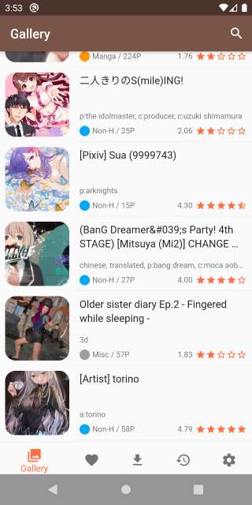
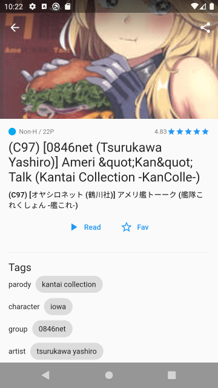
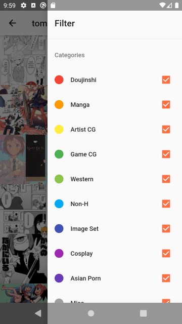
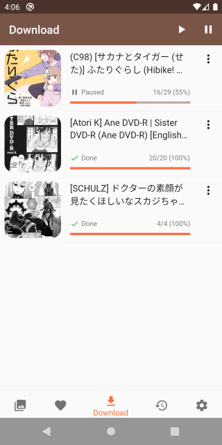

# EH Redux

    

A E-Hentai reader written in Flutter. This project is still under development. Some features are not implemented yet.

## Requirements

Android 4.4 and above

## Download

[Latest APK]((https://github.com/tommy351/eh-redux/releases/latest/download/app-arm64-v8a-release.apk))

Using devices that do not support ARM64? See [other versions](https://github.com/tommy351/eh-redux/releases).

## Screenshots

    

## Contributing

See [CONTRIBUTING.md](CONTRIBUTING.md).

## License

Apache License 2.0

Logo is made by [Good Ware](https://www.flaticon.com/authors/good-ware) from [www.flaticon.com](https://www.flaticon.com/free-icon/panda_2675616).
